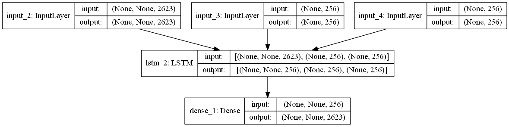

# seq2seq_keras
1. Construct seq2seq model by keras.
2. An example and explicit comment of translation from English to Chinese.
3. Model structure:

4. encoder:

   

5. decoder:

   

6. result:

   

